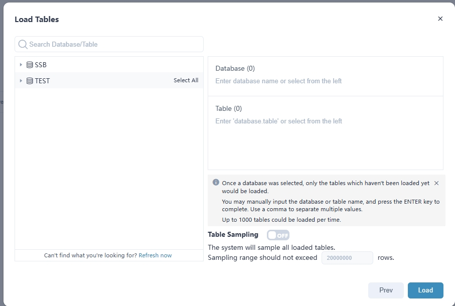
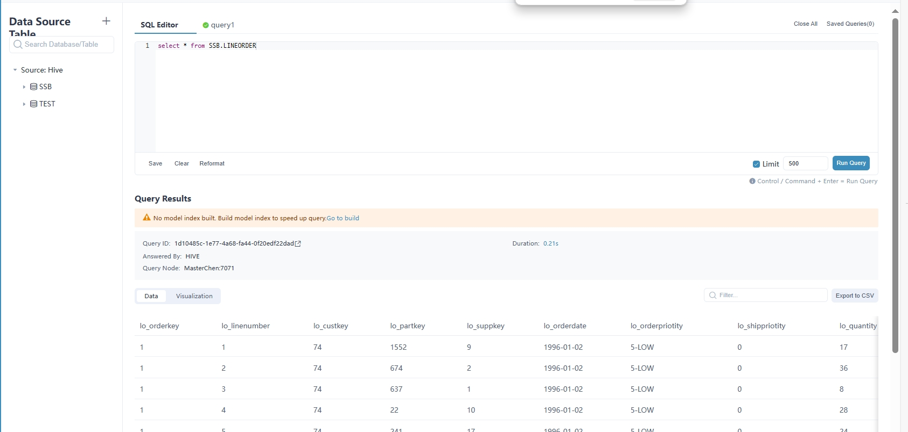

# Apache Kylin 5.0在Ubuntu18.04的部署教程

## 1、简介

本篇博客，将详细介绍`Apache Kylin 5.0`的在`Hadoop环境`上的部署过程以及碰到的问题。

## 2、已有集群环境

本次`Kylin`在已有大数据系统换上搭建，`Hadoop`、`Yarn`、`ZooKeeper`、`Spark`、`Hive`等前置大数据组件的搭建，可以参考我其余的文章。具体前置环境如下：

| 软件      | 版本   | 部署模式       |
| --------- | ------ | -------------- |
| Ubuntu    | 18.04  | 6节点          |
| Java      | 1.8    |                |
| Hadoop    | 3.2.1  | 高可用模式     |
| Yarn      | 3.2.1  | 高可用模式     |
| Zookeeper | 3.4.6  | 3节点集群      |
| Spark     | 3.1.2  | Standalone模式 |
| Hive      | 3.1.2  |                |
| Mysql     | 5.7.43 |                |

## 3、权限确认

确保运行`Kylin`的`linux `账号对`Hadoop`和`Hive`用于读写权限。

- 在`cmd`终端可对Hadoop集群做如下操作。

```shell
hadoop fs -mkdir /kylin
hadoop fs -chown czl /kylin
hadoop fs-mkdir /user/czl 
hadoop fs -chown czl /user/czl
hadoop fs -put <any_file> /kylin
hadoop fs -put <any_file> /user/czl   
```

- 在`Hive`终端可进行如下操作

```she
#hive
hive> show databases;
hive> use kylinDB;
hive> show tables;
hive> insert into t1 values(1, "kylin");
hive> select * from t1;
```

## 4、安装和配置环境变量

```shell
sudo tar -zxvf apache-kylin-5.0.0-beta-bin.tar.gz -C /usr/local/
sudo mv apache-kylin-5.0.0-beta-bin kylin
```

```shell
export KYLIN_HOME=/usr/local/kylin
export PATH=$PATH:$KYLIN_HOME/bin
```

## 5、修改kylin.properties配置

### 5.1设置数据库链接,修改ip、port、用户名和密码

```shell
kylin.metadata.url=kylin_metadata@jdbc,driverClassName=com.mysql.jdbc.Driver,url=jdbc:mysql://ip:3306/kylin?useUnicode=true&characterEncoding=utf8,username=root,password=root,maxTotal=50,maxIdle=8
```

### 5.2、设置`Zookeeper`地址

```shell
kylin.env.zookeeper-connect-string=ip1:2181,ip2:2181,ip3:2181
```

### 5.3、设置Spark

```shell
#这里设置了Spark On Yarn用Cluster模式部署
kylin.engine.spark-conf.spark.submit.deployMode=cluster
kylin.storage.columnar.spark-conf.spark.driver.host=xx.xx.xx.xx
```

### 5.4、设置Hadoop和Hive的配置文件路径

```shell
kylin.env.apache-hadoop-conf-dir=/usr/local/hadoop/etc/hadoop
kylin.env.apache-hive-conf-dir=/usr/local/hive/conf
```

### 5.5、其余配置

```shell
#按需配置性能
kylin.storage.columnar.spark-conf.spark.executor.memory=4096m
kylin.storage.columnar.spark-conf.spark.executor.cores=4
kylin.storage.columnar.spark-conf.spark.executor.instances=4
```

## 6、新建hadoop_conf目录

在`Kylin`的安装路径下新建`hadoop_conf`文件夹

添加`Hadoop`和`Hive`相关文件

- `core-site.xml`
- `hdfs-site.xml`
- `hive-site.xml`
- `yarn-site.xml`
- `mapred-site.xml`
- `log4j.properties`

## 7、复制Spark

复制`Spark`环境到`Kylin`安装目录下。

本文使用的是`spark-3.1.2-bin-without-hadoop`

在`Spark`目录下建立`hive_1_2_2`文件夹，放入相关`jar`包。参考依赖如下：

```shell
org.apache.ant_ant-1.9.1.jar
org.fusesource.leveldbjni_leveldbjni-all-1.8.jar
com.sun.jersey_jersey-json-1.14.jar
org.apache.commons_commons-math3-3.1.1.jar
org.datanucleus_datanucleus-api-jdo-3.2.6.jar
com.google.code.gson_gson-2.2.4.jar
io.netty_netty-3.7.0.Final.jar
org.apache.directory.server_apacheds-i18n-2.0.0-M15.jar
org.apache.directory.api_api-asn1-api-1.0.0-M20.jar
jetty-7.0.0.pre5.jar
xml-apis_xml-apis-1.3.04.jar
log4j_apache-log4j-extras-1.2.17.jar
xmlenc_xmlenc-0.52.jar
log4j_log4j-1.2.17.jar
org.antlr_stringtemplate-3.2.1.jar
javax.transaction_jta-1.1.jar
com.sun.jersey_jersey-client-1.9.jar
zookeeper-3.4.10.jar
protobuf-java-3.4.0.jar
com.google.code.findbugs_jsr305-3.0.0.jar
joda-time_joda-time-2.5.jar
com.sun.jersey_jersey-server-1.14.jar
org.codehaus.jackson_jackson-mapper-asl-1.9.13.jar
commons-beanutils_commons-beanutils-1.7.0.jar
org.apache.hive.shims_hive-shims-0.23-1.2.2.jar
com.sun.jersey_jersey-core-1.14.jar
commons-collections_commons-collections-3.2.2.jar
org.apache.ivy_ivy-2.4.0.jar
org.tukaani_xz-1.0.jar
commons-digester_commons-digester-1.8.jar
com.thoughtworks.paranamer_paranamer-2.3.jar
org.antlr_antlr-runtime-3.4.jar
jline_jline-2.12.jar
javax.jdo_jdo-api-3.0.1.jar
commons-pool_commons-pool-1.5.4.jar
org.json_json-20090211.jar
javax.inject_javax.inject-1.jar
org.apache.directory.api_api-util-1.0.0-M20.jar
javax.xml.bind_jaxb-api-2.2.2.jar
org.apache.derby_derby-10.10.2.0.jar
com.sun.jersey.contribs_jersey-guice-1.9.jar
jetty-util-7.0.0.pre5.jar
aopalliance_aopalliance-1.0.jar
com.google.guava_guava-14.0.1.jar
commons-io_commons-io-2.4.jar
org.apache.velocity_velocity-1.5.jar
commons-net_commons-net-3.1.jar
org.datanucleus_datanucleus-core-3.2.10.jar
javax.activation_activation-1.1.jar
commons-codec_commons-codec-1.4.jar
org.apache.hive_hive-serde-1.2.2.jar
com.sun.xml.bind_jaxb-impl-2.2.3-1.jar
commons-httpclient_commons-httpclient-3.1.jar
commons-cli_commons-cli-1.2.jar
commons-logging_commons-logging-1.1.3.jar
org.apache.hive_hive-common-1.2.2.jar
org.apache.hive.shims_hive-shims-scheduler-1.2.2.jar
net.sf.opencsv_opencsv-2.3.jar
org.antlr_ST4-4.0.4.jar
javax.servlet.jsp_jsp-api-2.1.jar
hive-contrib-1.1.0-cdh5.16.2.jar
org.slf4j_slf4j-api-1.7.10.jar
asm_asm-3.2.jar
oro_oro-2.0.8.jar
io.netty_netty-all-4.0.23.Final.jar
org.apache.hive.shims_hive-shims-0.20S-1.2.2.jar
groovy-all-2.4.7.jar
org.mortbay.jetty_jetty-sslengine-6.1.26.jar
commons-dbcp_commons-dbcp-1.4.jar
commons-beanutils_commons-beanutils-core-1.8.0.jar
org.codehaus.jackson_jackson-core-asl-1.9.13.jar
com.jolbox_bonecp-0.8.0.RELEASE.jar
org.apache.httpcomponents_httpcore-4.4.jar
org.apache.ant_ant-launcher-1.9.1.jar
org.xerial.snappy_snappy-java-1.0.5.jar
org.apache.thrift_libthrift-0.9.2.jar
org.apache.commons_commons-compress-1.4.1.jar
com.google.inject.extensions_guice-servlet-3.0.jar
antlr_antlr-2.7.7.jar
org.apache.thrift_libfb303-0.9.2.jar
org.apache.httpcomponents_httpclient-4.4.jar
org.codehaus.jackson_jackson-xc-1.9.13.jar
com.twitter_parquet-hadoop-bundle-1.6.0.jar
org.apache.directory.server_apacheds-kerberos-codec-2.0.0-M15.jar
org.apache.hive.shims_hive-shims-common-1.2.2.jar
org.sonatype.sisu.inject_cglib-2.2.1-v20090111.jar
javax.xml.stream_stax-api-1.0-2.jar
org.apache.hive_hive-metastore-1.2.2.jar
stax_stax-api-1.0.1.jar
org.slf4j_slf4j-log4j12-1.7.10.jar
org.codehaus.jettison_jettison-1.1.jar
org.codehaus.jackson_jackson-jaxrs-1.9.13.jar
com.google.inject_guice-3.0.jar
commons-configuration_commons-configuration-1.6.jar
org.apache.hive_hive-shims-1.2.2.jar
org.apache.hive_hive-ant-1.2.2.jar
org.apache.htrace_htrace-core-3.1.0-incubating.jar
org.datanucleus_datanucleus-rdbms-3.2.9.jar
org.apache.hive_hive-exec-1.2.2.jar
org.apache.avro_avro-1.7.5.jar
commons-lang_commons-lang-2.6.jar
```

`Spark`的`jars`目录下文件如下，可以参考。

```shell
delta-core_2.12-2.0.2.jar
hive-shims-common-2.3.9.jar
commons-dbcp-1.4.jar
chill_2.12-0.10.0.jar
javax.annotation-api-1.3.2.jar
jackson-core-2.13.3.jar
javassist-3.25.0-GA.jar
hadoop-mapreduce-client-shuffle-2.7.4.jar
jackson-xc-1.9.13.jar
parquet-jackson-1.12.2-kylin-r5.jar
lz4-java-1.7.1.jar
jersey-common-2.35.jar
apacheds-kerberos-codec-2.0.0-M15.jar
commons-cli-1.2.jar
shims-0.9.0.jar
transaction-api-1.1.jar
commons-compiler-3.0.16.jar
json4s-scalap_2.12-3.7.0-M11.jar
netty-resolver-dns-native-macos-4.1.89.Final-osx-x86_64.jar
commons-lang-2.6.jar
log4j-1.2-api-2.18.0.jar
jackson-annotations-2.13.3.jar
opencsv-2.3.jar
protobuf-java-3.16.3.jar
scala-xml_2.12-1.2.0.jar
netty-resolver-4.1.89.Final.jar
hive-shims-0.23-2.3.9.jar
hk2-utils-2.6.1.jar
netty-codec-mqtt-4.1.89.Final.jar
spark-core_2.12-3.2.0-kylin-4.6.9.0.jar
guice-3.0.jar
arpack-2.2.0.jar
hive-shims-scheduler-2.3.9.jar
json4s-jackson_2.12-3.7.0-M11.jar
hive-serde-2.3.9.jar
spark-launcher_2.12-3.2.0-kylin-4.6.9.0.jar
orc-shims-1.6.11.jar
stax-api-1.0.1.jar
datanucleus-api-jdo-4.2.4.jar
commons-net-3.1.jar
jetty-7.0.0.pre5.jar
hadoop-yarn-server-web-proxy-2.7.4.jar
spark-sql_2.12-3.2.0-kylin-4.6.9.0.jar
netty-handler-proxy-4.1.89.Final.jar
gson-2.8.9.jar
api-i18n-1.0.3.jar
spark-hive-thriftserver_2.12-3.2.0-kylin-4.6.9.0.jar
HikariCP-2.5.1.jar
hive-vector-code-gen-2.3.9.jar
orc-mapreduce-1.6.11.jar
breeze-macros_2.12-1.2.jar
breeze_2.12-1.2.jar
hadoop-mapreduce-client-core-2.7.4.jar
jersey-server-2.35.jar
netty-codec-redis-4.1.89.Final.jar
univocity-parsers-2.9.0.jar
spark-catalyst_2.12-3.2.0-kylin-4.6.9.0.jar
parquet-hadoop-1.12.2-kylin-r5.jar
netty-codec-haproxy-4.1.89.Final.jar
minlog-1.3.0.jar
javax.jdo-3.2.0-m3.jar
jakarta.annotation-api-1.3.5.jar
jta-1.1.jar
leveldbjni-all-1.8.jar
hadoop-annotations-2.7.4.jar
macro-compat_2.12-1.1.1.jar
core-1.1.2.jar
hive-metastore-2.3.9.jar
netty-transport-native-kqueue-4.1.89.Final-osx-x86_64.jar
hadoop-client-2.7.4.jar
htrace-core-3.1.0-incubating.jar
netty-transport-udt-4.1.89.Final.jar
spark-yarn_2.12-3.2.0-kylin-4.6.9.0.jar
spark-unsafe_2.12-3.2.0-kylin-4.6.9.0.jar
orc-core-1.6.11.jar
blas-2.2.0.jar
json-1.8.jar
annotations-17.0.0.jar
netty-all-4.1.89.Final.jar
cats-kernel_2.12-2.1.1.jar
hive-beeline-2.3.9.jar
netty-transport-sctp-4.1.89.Final.jar
netty-transport-classes-epoll-4.1.89.Final.jar
curator-client-2.7.1.jar
hk2-locator-2.6.1.jar
arrow-memory-netty-2.0.0.jar
curator-recipes-2.7.1.jar
metrics-jmx-4.2.0.jar
json4s-ast_2.12-3.7.0-M11.jar
hive-jdbc-2.3.9.jar
api-asn1-api-1.0.3.jar
netty-resolver-dns-native-macos-4.1.89.Final-osx-aarch_64.jar
netty-codec-smtp-4.1.89.Final.jar
zstd-jni-1.5.0-4.jar
kylin-soft-affinity-cache-5.0.0-beta.jar
parquet-encoding-1.12.2-kylin-r5.jar
hadoop-yarn-client-2.7.4.jar
hadoop-mapreduce-client-common-2.7.4.jar
spire-util_2.12-0.17.0.jar
netty-codec-dns-4.1.89.Final.jar
lapack-2.2.0.jar
jakarta.ws.rs-api-2.1.6.jar
avro-ipc-1.11.1.jar
jpam-1.1.jar
stream-2.9.6.jar
netty-codec-stomp-4.1.89.Final.jar
commons-configuration-1.6.jar
javax.inject-1.jar
netty-codec-memcache-4.1.89.Final.jar
spark-hive_2.12-3.2.0-kylin-4.6.9.0.jar
spark-sql-kafka-0-10_2.12-3.2.0-kylin-4.6.9.0.jar
pyrolite-4.30.jar
flatbuffers-java-1.9.0.jar
hive-storage-api-2.7.2.jar
netty-transport-rxtx-4.1.89.Final.jar
spire_2.12-0.17.0.jar
datanucleus-core-4.1.17.jar
log4j-web-2.18.0.jar
osgi-resource-locator-1.0.3.jar
parquet-common-1.12.2-kylin-r5.jar
activation-1.1.1.jar
RoaringBitmap-0.9.0.jar
objenesis-2.6.jar
aircompressor-0.21.jar
threeten-extra-1.5.0.jar
JTransforms-3.1.jar
metrics-jvm-4.2.0.jar
api-util-1.0.3.jar
kylin-external-guava30-5.0.0.jar
spark-tags_2.12-3.2.0-kylin-4.6.9.0.jar
istack-commons-runtime-3.0.8.jar
hive-cli-2.3.9.jar
javolution-5.5.1.jar
algebra_2.12-2.0.1.jar
netty-transport-4.1.89.Final.jar
dropwizard-metrics-hadoop-metrics2-reporter-0.1.2.jar
metrics-core-4.2.0.jar
jersey-client-2.35.jar
metrics-json-4.2.0.jar
netty-codec-http2-4.1.89.Final.jar
netty-codec-xml-4.1.89.Final.jar
apacheds-i18n-2.0.0-M15.jar
oro-2.0.8.jar
jetty-util-7.0.0.pre5.jar
netty-codec-http-4.1.89.Final.jar
spark-sketch_2.12-3.2.0-kylin-4.6.9.0.jar
httpcore-4.4.14.jar
spark-kvstore_2.12-3.2.0-kylin-4.6.9.0.jar
netty-codec-4.1.89.Final.jar
kafka-clients-2.8.2.jar
avro-1.11.1.jar
commons-lang3-3.12.0.jar
rocksdbjni-6.20.3.jar
bonecp-0.8.0.RELEASE.jar
netty-common-4.1.89.Final.jar
scala-compiler-2.12.15.jar
jsp-api-2.1.jar
derby-10.14.2.0.jar
jersey-container-servlet-2.35.jar
netty-resolver-dns-4.1.89.Final.jar
arpack_combined_all-0.1.jar
jodd-core-5.3.0.jar
mysql-connector-java-8.0.30.jar
aopalliance-1.0.jar
netty-transport-native-unix-common-4.1.89.Final.jar
shapeless_2.12-2.3.3.jar
netty-buffer-4.1.89.Final.jar
jackson-module-scala_2.12-2.13.3.jar
hadoop-auth-2.7.4.jar
jersey-hk2-2.35.jar
tomcat-embed-core-9.0.72.jar
slf4j-log4j12-1.7.30.jar
jodd-util-6.0.0.jar
spark-mllib_2.12-3.2.0-kylin-4.6.9.0.jar
hive-exec-2.3.9-core.jar
guice-servlet-3.0.jar
scala-library-2.12.15.jar
netty-resolver-dns-classes-macos-4.1.89.Final.jar
hive-contrib-1.1.0-cdh5.16.2.jar
commons-httpclient-3.1.jar
spark-token-provider-kafka-0-10_2.12-3.2.0-kylin-4.6.9.0.jar
commons-pool2-2.6.2.jar
arrow-vector-2.0.0.jar
jetty-sslengine-6.1.26.jar
netty-handler-ssl-ocsp-4.1.89.Final.jar
spire-macros_2.12-0.17.0.jar
jackson-jaxrs-1.9.13.jar
commons-io-2.8.0.jar
antlr4-runtime-4.8.jar
hadoop-mapreduce-client-app-2.7.4.jar
tink-1.6.0.jar
libfb303-0.9.3.jar
arrow-memory-core-2.0.0.jar
JLargeArrays-1.5.jar
jakarta.xml.bind-api-2.3.2.jar
commons-beanutils-1.9.4.jar
spark-graphx_2.12-3.2.0-kylin-4.6.9.0.jar
commons-pool-1.5.4.jar
commons-logging-1.1.3.jar
netty-transport-classes-kqueue-4.1.89.Final.jar
xmlenc-0.52.jar
hive-common-2.3.9.jar
avro-mapred-1.11.1.jar
commons-math3-3.4.1.jar
arrow-format-2.0.0.jar
zookeeper-3.4.14.jar
scala-parser-combinators_2.12-1.1.2.jar
janino-3.0.16.jar
netty-codec-socks-4.1.89.Final.jar
paranamer-2.8.jar
audience-annotations-0.5.0.jar
commons-text-1.10.0.jar
ST4-4.0.4.jar
kryo-shaded-4.0.2.jar
tomcat-annotations-api-9.0.68.jar
py4j-0.10.9.2.jar
spark-repl_2.12-3.2.0-kylin-4.6.9.0.jar
spire-platform_2.12-0.17.0.jar
netty-transport-native-kqueue-4.1.89.Final-osx-aarch_64.jar
netty-transport-native-epoll-4.1.89.Final-linux-x86_64.jar
slf4j-api-1.7.30.jar
hadoop-yarn-common-2.7.4.jar
xml-apis-1.4.01.jar
hk2-api-2.6.1.jar
spark-network-shuffle_2.12-3.2.0-kylin-4.6.9.0.jar
xbean-asm9-shaded-4.20.jar
scala-reflect-2.12.15.jar
commons-collections-3.2.2.jar
netty-handler-4.1.89.Final.jar
commons-digester-1.8.jar
commons-compress-1.21.jar
jakarta.inject-2.6.1.jar
hadoop-yarn-server-common-2.7.4.jar
libthrift-0.12.0.jar
jdo-api-3.0.1.jar
aopalliance-repackaged-2.6.1.jar
log4j-core-2.18.0.jar
parquet-format-structures-1.12.2-kylin-r5.jar
super-csv-2.2.0.jar
hadoop-mapreduce-client-jobclient-2.7.4.jar
hive-shims-2.3.9.jar
snappy-java-1.1.8.4.jar
jersey-container-servlet-core-2.35.jar
compress-lzf-1.0.3.jar
hive-service-rpc-3.1.2.jar
spark-network-common_2.12-3.2.0-kylin-4.6.9.0.jar
hadoop-common-2.7.4.jar
joda-time-2.10.10.jar
jackson-core-asl-1.9.13.jar
jackson-databind-2.13.4.2.jar
httpclient-4.5.13.jar
jline-2.14.6.jar
log4j-jul-2.17.2.jar
jakarta.validation-api-2.0.2.jar
log4j-api-2.18.0.jar
jul-to-slf4j-1.7.30.jar
datanucleus-rdbms-4.1.19.jar
commons-crypto-1.1.0.jar
chill-java-0.10.0.jar
log4j-slf4j-impl-2.18.0.jar
hadoop-hdfs-2.7.4.jar
spark-mllib-local_2.12-3.2.0-kylin-4.6.9.0.jar
scala-collection-compat_2.12-2.1.1.jar
spark-streaming_2.12-3.2.0-kylin-4.6.9.0.jar
jaxb-runtime-2.3.2.jar
parquet-column-1.12.2-kylin-r5.jar
hadoop-yarn-api-2.7.4.jar
alluxio-shaded-client-2.7.4.jar
jackson-mapper-asl-1.9.13.jar
commons-codec-1.15.jar
antlr-runtime-3.5.2.jar
xercesImpl-2.12.0.jar
hive-llap-common-2.3.9.jar
xz-1.8.jar
jakarta.servlet-api-4.0.3.jar
ivy-2.5.1.jar
json4s-core_2.12-3.7.0-M11.jar
guava-14.0.1.jar
metrics-graphite-4.2.0.jar
netty-transport-native-epoll-4.1.89.Final-linux-aarch_64.jar
curator-framework-2.7.1.jar
jcl-over-slf4j-1.7.30.jar
jsr305-3.0.0.jar
jaxb-api-2.2.11.jar
```

## 8、添加MySQL JDBC driver包

将`Mysql JDBC driver Jar`包放到`Kylin`安装目录下的`/lib/ext`目录下。

官方使用的是`mysql-connector-java-8.0.30`,但是出现了问题，连接不上`Mysql`的`Hive`元数据库。

```shell
10:15:32.851 [main] ERROR DataNucleus.Datastore.Schema - Failed initialising database.
org.datanucleus.exceptions.NucleusDataStoreException: Unable to open a test connection to the given database. JDBC url = jdbc:mysql://ip:3306/hive?createDatabaseIfNotExist=true&useSSL=false, username = root. Terminating connection pool (set lazyInit to true if you expect to start your database after your app). Original Exception: ------
java.sql.SQLException: No suitable driver found for jdbc:mysql://ip:3306/hive?createDatabaseIfNotExist=true&useSSL=false
```

可能和机器的Spark环境有关，所以改用`mysql-connector-java-5.1.40-bin.jar`

## 9、环境检查

在`Kylin`的`bin`目录下启动`check-env.sh`,检查当前环境。

出现`Checking environment finished successfully`，表示通过。

```shell
[200~WARN: Ubuntu is not officially supported. Use at your own risk.
>   WARN: 'dfs.client.read.shortcircuit' is not enabled which could impact query performance. Check /usr/local/kylin/hadoop_conf/hdfs-site.xml
>   WARN: Ubuntu is not officially supported. Use at your own risk.
>   WARN: 'dfs.client.read.shortcircuit' is not enabled which could impact query performance. Check /usr/local/kylin/hadoop_conf/hdfs-site.xml
>   WARN: Ubuntu is not officially supported. Use at your own risk.
>   WARN: 'dfs.client.read.shortcircuit' is not enabled which could impact query performance. Check /usr/local/kylin/hadoop_conf/hdfs-site.xml
>   Available YARN RM cores: 32
>   Available YARN RM memory: 32768M
>   The max executor instances can be 8
>   The current executor instances is 2
Checking environment finished successfully. To check again, run 'bin/check-env.sh' manually.
```

## 10、环境启动

在`Kylin`的`bin`目录下输入`kylin.sh start`启动系统，看到页面启动成功。


正常加载`Hive`库表数据



正常执行查询操作。



## 11、参考tar下载

这是目前使用的Kylin环境，打包后放在百度网盘，此外还包括官网现在版本。
链接：https://pan.baidu.com/s/1eesv1zZLRrRWi4MYOGAnUw
提取码：nhjs