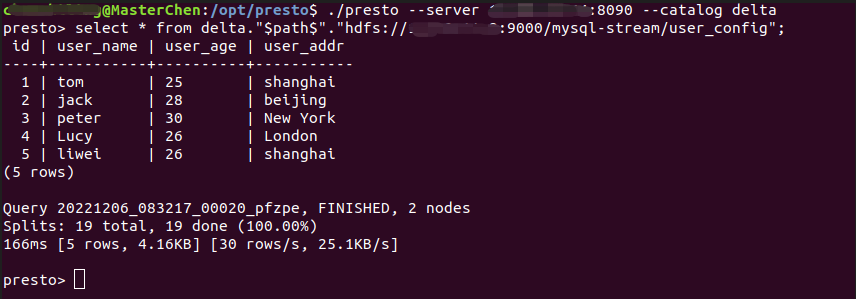

# presto集群部署，并读取hdfs上的delta lake数据

- 记录presto的安装与部署，使用presto的版本为0.278

- 使用presto读取在hdfs上的delta数据

## 1.节点设计

|             | node1 | node2 | node3 |
| ----------- | ----- | ----- | ----- |
| coordinator | ✔     |       |       |
| worker      |       | ✔     | ✔     |

## 2. 配置文件

在安装目录中创建一个etc目录，包含以下配置文件：

- node.properties: 每个节点的环境配置
- jvm.config: JVM的命令行选项
- config.properties: Presto Server的配置项
- catalog/delta.properties: 数据源连接器的配置，我们使用presto读取delta数据

### 2.1 node.properties

node.environment：环境的名称。所有节点的环境名称需一样，不能有特殊符号，启动会报错。

node.id：Presto安装的唯一标识符。所有节点都要不一样

- node1

```properties
node.environment=nhprod
node.id=nanhulab-2022-1205-node1
node.data-dir=/var/presto/data
```

- node2

```properties
node.environment=nhprod
node.id=nanhulab-2022-1205-node2
node.data-dir=/var/presto/data
```

- node3

```properties
node.environment=nhprod
node.id=nanhulab-2022-1205-node3
node.data-dir=/var/presto/data
```

### 2.2 jvm.config

每个节点都一样,能使用空格或其他特殊字符

```properties
-server
-Xmx5G
-XX:+UseG1GC
-XX:G1HeapRegionSize=32M
-XX:+UseGCOverheadLimit
-XX:+ExplicitGCInvokesConcurrent
-XX:+HeapDumpOnOutOfMemoryError
-XX:+ExitOnOutOfMemoryError
```

### 2.3 config.properties

- node1设置为coordinator

```properties
coordinator=true
node-scheduler.include-coordinator=false
http-server.http.port=8090
query.max-memory=6GB
query.max-memory-per-node=2GB
discovery-server.enabled=true
discovery.uri=http://ip:8090
```

- node2,node3设置为worker

```properties
coordinator=false
http-server.http.port=8090
query.max-memory=6GB
query.max-memory-per-node=2GB
discovery.uri=http://ip:8090
```

### 2.4 log.properties

设置日志等级DEBUG,INFO,WARN和ERROR

```pr
com.facebook.presto=INFO
```

### 2.5 连接器配置

在etc下目录新建catalog文件夹，设置各类connector的文件

配置hive.config.resources的属性，避免presto找不到hadoop相关的文件

- delta.properties

```properties
connector.name=delta
hive.metastore.uri=thrift://ip:9083
hive.config.resources=/usr/local/hadoop/etc/hadoop/core-site.xml,/usr/local/hadoop/etc/hadoop/hdfs-site.xml
```

## 3. 启动

集群启动脚本

```shell
echo "开启presto集群"
for host in node1 node2 node3
do
 echo "开启$host的presto"
 ssh $host "source /etc/profile;/opt/presto/bin/launcher start"
done
```

验证

- 可以访问web: http://ip:8090/ui/
- jps查看，有prestoServer进程

## 4. 使用Presto CLI访问

### 4.1 jar包授予权限

```shell
mv presto-cli-0.278-executable.jar presto
chmod +x presto
```

### 4.2 指定catalog为delta

```shell
./presto --server ip:8090 --catalog delta
```

### 4.3 sql查询

直接使用delta表的path进行查询 ，我这边delta表在hadoop上，所以是hdfs开头

- delta是catalog的名称
- "$path$"指明表名是路径，个人觉得也可以理解为Schema。show schemas可以看到有"$path$"

- 全路径为delta."$path$".开头，后面加delta的path
- ***<u>delta表的path不能有大写字母，presto会将路径小写，导致找不到path，一直报错，大坑！！！！</u>***

```sql
select * from delta."$path$"."hdfs:ip:9000/data"
```

